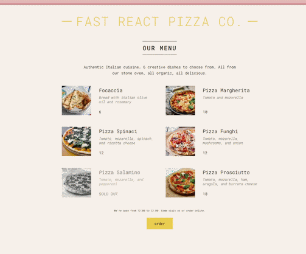

🍕 Pizza Website

A modern pizza ordering UI built using React.
This project was created while learning from Jonas Schmedtmann’s React course.

🚀 Live Demo

👉 https://suspect-911.github.io/pizza-website/

🛠️ Tech Stack

🎥 Demo Preview

✨ Features

- 🍕 Display pizza menu
- 🛒 Add to cart functionality
- 📱 Responsive design
- ⚡ Fast loading (optimized build)

📂 Project Structure

pizza-website/
├── index.html
├── assets/
├── pizzas/
└── icons.avif

🧠 What I Learned

- React components
- Props & state
- Project structuring
- Building and deploying React apps

📦 Installation (for developers)

git clone https://github.com/SUSPECT-911/pizza-website.git
cd pizza-website
npm install
npm run dev

📌 Deployment

This project is deployed using GitHub Pages.

🙌 Credits

Course by Jonas Schmedtmann

📬 Contact

If you like this project, feel free to connect!
